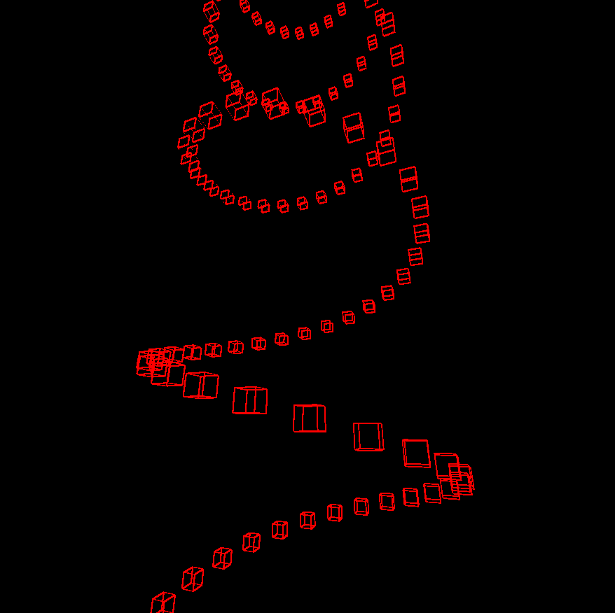

# Woaaahhh what am i looking at!?!?!
This is a small example of simple 3D graphics written using SFML.
Probably not how anything should be built for anything serious, but I had fun and that is what matters.
Simple practice refrence for myself how to create 3D graphics and structure Rust projects.

WASD to move, RF to ascend and descend and ←↑→↓ and PgUp/PgDown too look around.

**PROBLEMS!!!**

Lines drawn in the 3D logic are in view when behind the player,
should probably fix this but it looks quite cool at times...

